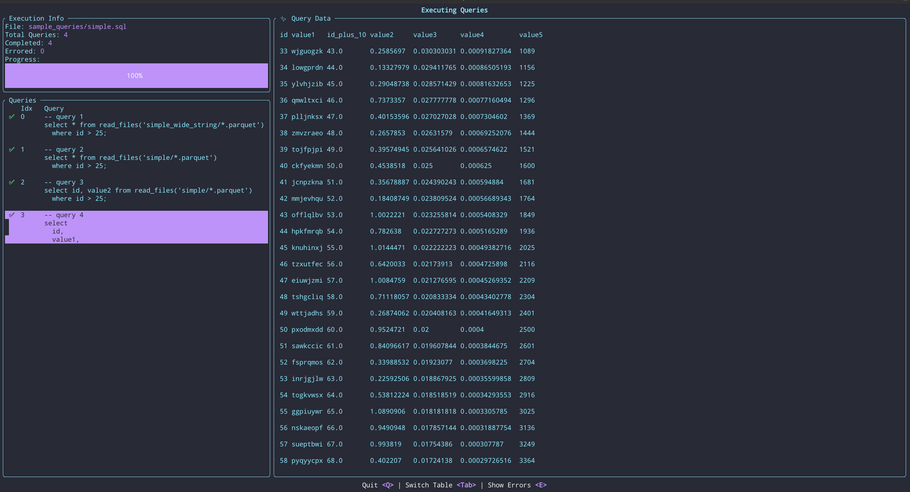

# 📖 ChapterhouseQE
A simple SQL query engine capable of distributing work across a set of
workers. The intent of this project is to allow me to test out various 
query optimization techniques.




## Running the Base System Using Docker

1. Build the image
```
DOCKER_BUILDKIT=1 docker compose build chqe-debug-node
```

2. Start a container
```
DOCKER_BUILDKIT=1 docker compose up chqe-debug-node
```

At this point the system will be ready to accept requests. The image
is built with a small set of example datasets that can be queried.


## Running the TUI

You can run the TUI with a set of example queries using this command

```
cargo run --bin client_tui -- --sql-file="sample_queries/simple.sql" --connect-to-address="127.0.0.1"
```

The TUI will send the queries to the worker and allow you to visualize
the result data of the queries in a table.


## Running the Base System Using Cargo

1. Create the sample data by running the following command

  ```bash
cargo run --bin create_sample_data -- --connection-name="default" --config-file="worker_configs/fs_worker_config.json" --path-prefix="./"
  ```

2. Now start the workers to form a cluster. Start first worker

  ```bash
cargo run --bin main -- --config-file="worker_configs/fs_worker_config.json"
  ```

Query results for this worker configuration will be stored in the `./sample_data` directory.


## Using the Sample Data Script

Create sample data in a local directory
```bash
cargo run --bin create_sample_data -- --connection-name="default" --config-file="worker_configs/fs_worker_config.json" --path-prefix="./"
```

Create sample data in Minio
```bash
docker compose up -d minio
cargo run --bin create_sample_data -- --connection-name="default" --config-file="worker_configs/s3_worker_config.json" --path-prefix="sample_data"
```
If you want to use the script to create sample data in S3 or another S3 compatible
object storage you'll need to create a new worker configuration file that contains
that connection.


## 🛢️ Supported SQL

- [X] Types
  - [X] Numeric types
  - [X] String type
  - [ ] Time types
  - [ ] Decimal types
- [x] Expressions
  - [X] Basic mathematical operations
  - [X] AND, OR
  - [ ] XOR
  - [ ] String concatenation ||
  - [ ] LIKE, ILIKE
- [X] Select statement
  - [X] Projection
  - [X] Where
  - [ ] Order by
  - [ ] Group by
  - [ ] Having
  - [ ] Inner join
  - [ ] Left join
  - [ ] Right join
  - [ ] Full join
  - [ ] With 
  - [X] Read from files (Ex `read_files('simple/*.parquet')`)
    - [X] Parquet
    - [ ] CSV
    - [ ] JSON
  - [ ] Read from table

## 🛠 Architecture

The system is built upon a set of distributed actors that communicate through
messages. Each worker can communicate with all other workers connected to it
and any worker can accept and manage queries. Queries create operators, a type of actor
capable of performing the tasks necessary to compute a query result. For example, the query:
```
select * from read_files('simple/*.parquet')
  where value2 > 10.0;
```

will produce these operators
```
[read files] -> [exchange] -> [filter] -> [exchange] -> [materialize] -> [exchange]
```

Each of the operators in this query can also have individual instances of themselves so that
its task can be computed in parallel. These operators perform some operation
on an Apache Arrow record batch. The read files operator reads records from the parquet
files and pushes them to the exchange operator. Then the filter operator pulls the next
available record from that exchange operator and produces a record containing only
the data matching the "where" expression. And so on until the DAG of operators has completed. By 
structuring the operators in this way it makes it relatively easy to create new operators
as each operator either pulls data from an exchange or an external source, and pushes
data to an exchanges.


