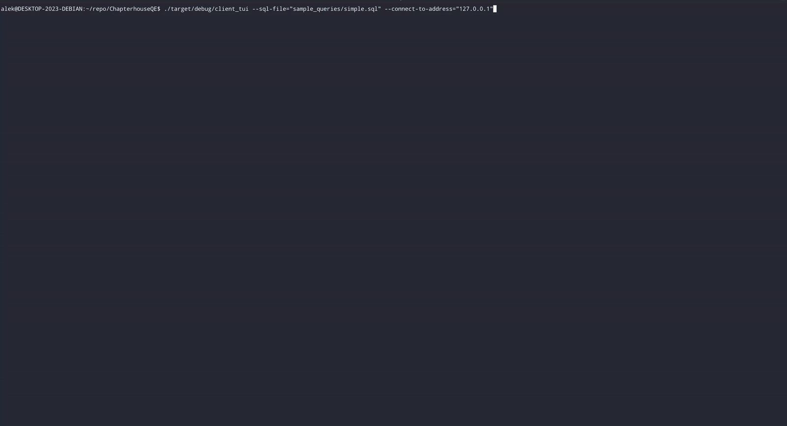

# 📖 ChapterhouseQE
A simple distributed SQL query engine written in Rust. Currently this project
is in early development but the end goals is to create a SQL based development
environment where engineers can deploy Rust data processing applications connected
and operated using SQL. You will use Rust to handle reading data from API's, transforming
complex data types, etc. And you will use SQL to clean, move and store data.




## Running the Base System Using Docker

1. Build the image
```
DOCKER_BUILDKIT=1 docker compose build chqe-debug-node
```

2. Start a container
```
DOCKER_BUILDKIT=1 docker compose up chqe-debug-node
```

At this point the system will be ready to accept requests. The image
is built with a small set of example datasets that can be queried.


## Running the TUI

You can run the TUI with a set of example queries using this command

```
cargo run --bin client_tui -- --sql-file="sample_queries/simple.sql" --connect-to-address="127.0.0.1"
```

The TUI will send the queries to the worker and allow you to visualize
the result data of the queries in a table.


## Running the Base System Using Cargo

1. Create the sample data by running the following command

  ```bash
cargo run --bin create_sample_data -- --connection-name="default" --config-file="worker_configs/fs_worker_config.json" --path-prefix="sample_data"
  ```

2. Now start the workers to form a cluster. Start first worker

  ```bash
cargo run --bin main -- --config-file="worker_configs/fs_worker_config.json"
  ```

Query results for this worker configuration will be stored in the `./sample_data` directory.


## Using the Sample Data Script

Create sample data in a local directory
```bash
cargo run --bin create_sample_data -- --connection-name="default" --config-file="worker_configs/fs_worker_config.json" --path-prefix="sample_data"
```

Create sample data in Minio
```bash
docker compose up -d minio
cargo run --bin create_sample_data -- --connection-name="default" --config-file="worker_configs/s3_worker_config.json" --path-prefix="sample_data"
```
If you want to use the script to create sample data in S3 or another S3 compatible
object storage you'll need to create a new worker configuration file that contains
that connection.


## 🛢️ Supported SQL

- [X] Types
  - [X] Numeric types
  - [X] String type
  - [ ] Time types
  - [ ] Decimal types
- [x] Expressions
  - [X] Basic mathematical operations
  - [X] AND, OR
  - [ ] XOR
  - [ ] String concatenation ||
  - [ ] LIKE, ILIKE
- [X] Select statement
  - [X] Projection
  - [X] Where
  - [ ] Order by
  - [ ] Group by
  - [ ] Having
  - [ ] Inner join
  - [ ] Left join
  - [ ] Right join
  - [ ] Full join
  - [ ] With 
  - [X] Read from files (Ex `read_files('simple/*.parquet')`)
    - [X] Parquet
    - [ ] CSV
    - [ ] JSON
  - [ ] Read from table


## 🛠 Architecture

The system is built upon a set of distributed actors that communicate through
messages. Each worker can communicate with all other workers connected to it
and any worker can accept and manage queries. Queries create operators, a type of actor
capable of performing the tasks necessary to compute a query result. For example, the query:
```sql
select * from read_files('simple/*.parquet')
  where value2 > 10.0;
```

will produce these operators
```
[read files] -> [exchange] -> [filter] -> [exchange] -> [materialize] -> [exchange]
```

Each of the operators in this query can also have individual instances of themselves so that
its task can be computed in parallel. These operators perform some operation
on an Apache Arrow record batch. The read files operator reads records from the parquet
files and pushes them to the exchange operator. Then the filter operator pulls the next
available record from that exchange operator and produces a record containing only
the data matching the "where" expression. And so on until the DAG of operators has completed. By 
structuring the operators in this way it makes it relatively easy to create new operators
as each operator either pulls data from an exchange or an external source, and pushes
data to an exchanges.


## Future Functionality

- [ ] Support common SQL operations such as those listed in the "Supported SQL" section.
- [ ] The system should be able to handle distributing "generators" across the network of workers.
These generators are simply a Rust function which produces data of a known schema. The data is 
sent to an exchange which allows others queries to subscribe to that data. This will allow for composable workflows
where engineers can define their entire software and data stack inside of the same system. Here's an
example of what that could look like:

```sql
-- deploy the function to the cluster
deploy read_from_my_special_api(1000, '1 minute') as special_api_stream;

-- start a query that subscribes to that function
create table filtered_api_stream as (
  select id, lower(message) as lower_message, created_ts from batch(deploy.special_api_stream, 10_000, '5 seconds')
    where created_ts > now() - interval '5 minutes'
);
```

The query will consume data when 10,000 rows are available or when 5 seconds have passed, whichever comes first. 
The data will be loaded into a table named `filtered_api_stream` which can then be used by other queries. 
Since this query subscribes to a stream it has a lifetime dependent upon the steam. If the stream
is dropped then the query will also be dropped but the table it has create will remain. If the deployment
every restarts the streaming query will also restart. Here's how you would drop the deployment:

```sql
-- drop deployment
drop deploy special_api_stream;
```

The system will also be able to distribute a deployment using a select statement like this

```sql
-- create single deployment with many tasks
select
  deploy(
    read_from_api(config.url, 1000, '5 minutes'),
    'read_from_api'
  )
from read_files('config/api_deployments.json') as config
  where config.enabled = true
  limit 100;
```

This query will create a single deployment `read_from_api_stream` with multiple tasks associated to that same
deployment. Each task in the deployment will distribute data to the same exchange and all tasks have the same
lifetime. When the deployment is dropped all tasks will be dropped. In this case the query creates at most 100
tasks each reading data from an API with a page size of 1,000 every 5 minutes.

In theory you could deploy any kind of application inside of the cluster including web applications that 
serve webpages or API endpoints.

- [ ] WASM support for functions and deployables. This will allow the database to be upgraded separately 
  of the users application specific code.

- [ ] Create a Kubernetes integration which allows the system to scale based on demand. The nodes will need
to communicate their cluster IP through S3.


